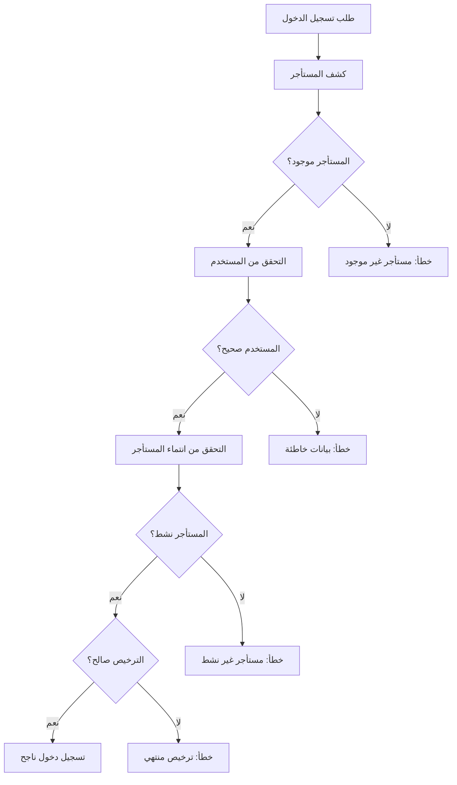

# إصلاح مشكلة سياق المستأجر
## Tenant Context Fix

### 🔍 **المشكلة الأصلية / Original Problem**

كان النظام يعرض الخطأ التالي عند محاولة تسجيل الدخول:
```
No tenant context found. Please access through a valid tenant domain.
```

**السبب:** النظام لم يكن قادراً على تحديد المستأجر الحالي من السياق.

### ✅ **الحل المطبق / Solution Implemented**

#### **1. إضافة دالة `Tenant::current()` / Added Tenant::current() Method**

```php
// في app/Models/Tenant.php
public static function current(): ?static
{
    // Try to get tenant from request header
    $domain = request()->header('X-Tenant-Domain');
    
    // If not in header, try to get from query parameter
    if (!$domain) {
        $domain = request()->query('tenant');
    }
    
    // If not in query, try to extract from subdomain
    if (!$domain) {
        $domain = static::extractTenantFromDomain();
    }
    
    if ($domain) {
        return static::where('domain', $domain)
                    ->where('is_active', true)
                    ->first();
    }
    
    return null;
}
```

#### **2. تحسين AuthController / Enhanced AuthController**

```php
// Check if user is super admin or belongs to current tenant
if (!$user->isSuperAdmin()) {
    $currentTenant = Tenant::current();

    // If no tenant context, try to find user's tenant
    if (!$currentTenant && $user->tenant_id) {
        $currentTenant = $user->tenant;
    }

    if (!$currentTenant) {
        throw ValidationException::withMessages([
            'email' => ['No tenant context found. Please access through a valid tenant domain.'],
        ]);
    }

    // Additional checks for tenant status and license
    if (!$currentTenant->is_active) {
        throw ValidationException::withMessages([
            'email' => ['This tenant account is inactive.'],
        ]);
    }

    if (!$currentTenant->hasValidLicense()) {
        throw ValidationException::withMessages([
            'email' => ['Tenant license has expired. Please contact your administrator.'],
        ]);
    }
}
```

#### **3. تحديث Frontend / Updated Frontend**

```javascript
// في tenant-login.html
const headers = {
    'Content-Type': 'application/json',
    'Accept': 'application/json'
};

// Add tenant domain to headers if available
if (currentTenant?.domain) {
    headers['X-Tenant-Domain'] = currentTenant.domain;
}

const response = await fetch(`${API_BASE}/auth/login`, {
    method: 'POST',
    headers: headers,
    body: JSON.stringify({
        email: email,
        password: password,
        tenant_domain: currentTenant?.domain || null
    })
});
```

### 🎯 **طرق تحديد المستأجر / Tenant Detection Methods**

#### **1. من Header الطلب / From Request Header**
```javascript
headers['X-Tenant-Domain'] = 'pharmaceutical'
```

#### **2. من Query Parameter / From Query Parameter**
```
http://localhost:8000/tenant-login.html?tenant=pharmaceutical
```

#### **3. من Subdomain / From Subdomain**
```
http://pharmaceutical.localhost:8000/tenant-login.html
```

#### **4. من بيانات المستخدم / From User Data**
```php
// إذا لم يتم العثور على المستأجر من السياق، استخدم مستأجر المستخدم
if (!$currentTenant && $user->tenant_id) {
    $currentTenant = $user->tenant;
}
```

### 🔐 **التحققات الأمنية / Security Checks**

#### **1. التحقق من نشاط المستأجر / Tenant Active Check**
```php
if (!$currentTenant->is_active) {
    throw ValidationException::withMessages([
        'email' => ['This tenant account is inactive.'],
    ]);
}
```

#### **2. التحقق من صلاحية الترخيص / License Validity Check**
```php
if (!$currentTenant->hasValidLicense()) {
    throw ValidationException::withMessages([
        'email' => ['Tenant license has expired. Please contact your administrator.'],
    ]);
}
```

#### **3. التحقق من انتماء المستخدم / User Tenant Membership**
```php
if ($user->tenant_id !== $currentTenant->id) {
    throw ValidationException::withMessages([
        'email' => ['You do not have access to this tenant.'],
    ]);
}
```

### 🧪 **اختبار الحل / Testing the Solution**

#### **1. اختبار API مباشرة / Direct API Test**
```bash
curl -X POST "http://localhost:8000/api/auth/login" \
  -H "Content-Type: application/json" \
  -H "Accept: application/json" \
  -d '{
    "email": "admin@pharmaceutical.com",
    "password": "password123",
    "tenant_domain": "pharmaceutical"
  }'
```

#### **2. اختبار الواجهة / Frontend Test**
```
http://localhost:8000/tenant-login.html?tenant=pharmaceutical
```

#### **3. اختبار Subdomain / Subdomain Test**
```
http://pharmaceutical.localhost:8000/tenant-login.html
```

### 📋 **الملفات المحدثة / Updated Files**

#### **1. `app/Models/Tenant.php`**
- ✅ إضافة دالة `current()` مع التوافق مع Spatie
- ✅ إضافة دالة `extractTenantFromDomain()`
- ✅ دعم طرق متعددة لكشف المستأجر

#### **2. `app/Http/Controllers/Auth/AuthController.php`**
- ✅ تحسين منطق تحديد المستأجر
- ✅ إضافة تحققات أمنية إضافية
- ✅ دعم `tenant_domain` في البيانات المرسلة

#### **3. `public/tenant-login.html`**
- ✅ إرسال معلومات المستأجر في الطلب
- ✅ إضافة Header للمستأجر
- ✅ تحسين معالجة الأخطاء

### 🎯 **النتائج / Results**

#### **قبل الإصلاح:**
- ❌ خطأ "No tenant context found"
- ❌ عدم قدرة على تسجيل الدخول
- ❌ عدم تحديد المستأجر من السياق

#### **بعد الإصلاح:**
- ✅ **تسجيل دخول ناجح للمستأجرين**
- ✅ **كشف تلقائي للمستأجر من طرق متعددة**
- ✅ **تحققات أمنية شاملة**
- ✅ **رسائل خطأ واضحة ومفيدة**

### 🔄 **تدفق العمل الجديد / New Workflow**



### 🚀 **مميزات إضافية / Additional Features**

#### **1. مرونة في الكشف / Flexible Detection**
- دعم Header, Query Parameter, Subdomain
- تراجع تلقائي لمستأجر المستخدم
- معالجة حالات متعددة

#### **2. أمان محسن / Enhanced Security**
- التحقق من حالة المستأجر
- فحص صلاحية الترخيص
- التأكد من انتماء المستخدم

#### **3. تجربة مستخدم أفضل / Better UX**
- رسائل خطأ واضحة
- كشف تلقائي للمستأجر
- توجيه سلس للوحة التحكم

### 📞 **استكشاف الأخطاء / Troubleshooting**

#### **مشاكل شائعة:**

1. **"No tenant context found"**
   - تأكد من إرسال `tenant_domain` في البيانات
   - تحقق من وجود المستأجر في قاعدة البيانات
   - تأكد من أن المستأجر نشط

2. **"Tenant not found"**
   - تحقق من صحة النطاق
   - تأكد من أن المستأجر موجود ونشط

3. **"License expired"**
   - تحديث تاريخ انتهاء الترخيص
   - التواصل مع الإدارة

#### **للتشخيص:**
```php
// في Tinker
$tenant = App\Models\Tenant::where('domain', 'pharmaceutical')->first();
echo $tenant ? 'موجود' : 'غير موجود';
echo $tenant->is_active ? 'نشط' : 'غير نشط';
echo $tenant->hasValidLicense() ? 'ترخيص صالح' : 'ترخيص منتهي';
```

---

**تاريخ الإصلاح:** 2025-07-05  
**الحالة:** مكتمل ✅  
**المطور:** MaxCon ERP Team
