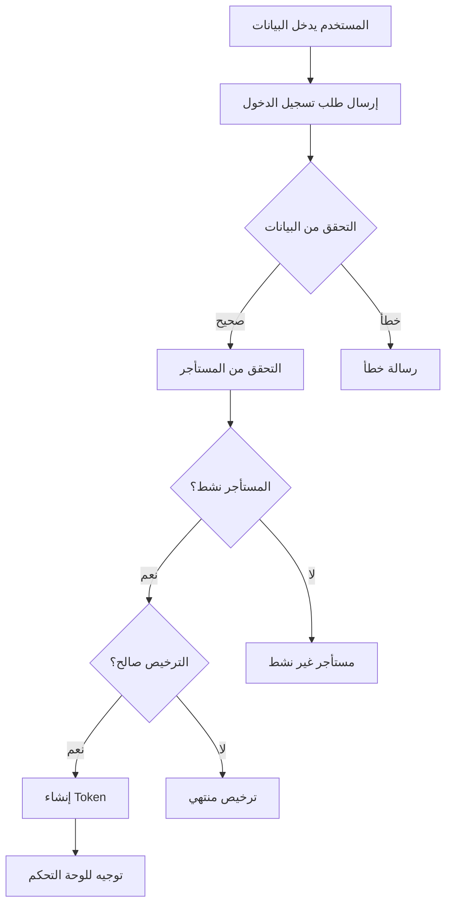

# دليل تسجيل الدخول للمستأجرين
## Tenant Login Guide

### 🏢 **كيفية الدخول كمستأجر / How to Login as Tenant**

#### **الطريقة الأولى: استخدام صفحة تسجيل الدخول المخصصة**

1. **افتح صفحة تسجيل الدخول:**
   ```
   http://localhost:8000/tenant-login.html
   ```

2. **أدخل بيانات الاعتماد:**
   - **البريد الإلكتروني:** `admin@pharmaceutical.com`
   - **كلمة المرور:** `password123`

3. **اضغط "تسجيل الدخول"**

4. **سيتم توجيهك إلى لوحة التحكم:**
   ```
   http://localhost:8000/tenant-dashboard.html
   ```

#### **الطريقة الثانية: تحديد المستأجر في الرابط**

```
http://localhost:8000/tenant-login.html?tenant=pharmaceutical
```

### 👤 **بيانات المستخدم التجريبي / Demo User Credentials**

| **الحقل** | **القيمة** |
|------------|-------------|
| **الاسم** | مدير الصيدلية |
| **البريد الإلكتروني** | admin@pharmaceutical.com |
| **كلمة المرور** | password123 |
| **المستأجر** | Mustafa Qasim |
| **النطاق** | pharmaceutical |
| **القسم** | الإدارة |
| **المنصب** | مدير عام |

### 🏗️ **هيكل النظام / System Architecture**

#### **1. صفحات المستأجر / Tenant Pages**

##### **أ. صفحة تسجيل الدخول (`tenant-login.html`)**
- تصميم عصري ومتجاوب
- دعم اللغة العربية (RTL)
- كشف تلقائي للمستأجر
- التحقق من صحة البيانات
- رسائل خطأ واضحة

##### **ب. لوحة التحكم (`tenant-dashboard.html`)**
- واجهة شاملة لإدارة الأعمال
- إحصائيات سريعة
- قائمة جانبية للوحدات
- إجراءات سريعة
- تصميم متجاوب

#### **2. API Endpoints للمستأجرين**

##### **أ. تسجيل الدخول**
```http
POST /api/auth/login
Content-Type: application/json

{
    "email": "admin@pharmaceutical.com",
    "password": "password123"
}
```

##### **ب. معلومات المستأجر**
```http
GET /api/tenant/info?domain=pharmaceutical
```

##### **ج. معلومات المستخدم**
```http
GET /api/auth/user
Authorization: Bearer {token}
```

##### **د. تسجيل الخروج**
```http
POST /api/auth/logout
Authorization: Bearer {token}
```

### 🔐 **نظام المصادقة / Authentication System**

#### **1. تدفق تسجيل الدخول / Login Flow**



#### **2. التحقق من الصلاحيات / Authorization**

- **Super Admin:** وصول كامل لجميع المستأجرين
- **Tenant User:** وصول محدود للمستأجر المحدد فقط
- **License Check:** التحقق من صلاحية الترخيص
- **Active Status:** التحقق من حالة المستأجر

### 🎨 **مميزات الواجهة / UI Features**

#### **1. صفحة تسجيل الدخول**

##### **التصميم:**
- خلفية متدرجة جذابة
- بطاقة تسجيل دخول شفافة
- أيقونات Bootstrap
- تأثيرات حركية

##### **الوظائف:**
- كشف تلقائي للمستأجر من الرابط
- إظهار/إخفاء كلمة المرور
- تذكر المستخدم
- رسائل تحميل
- التحقق من الجلسة الموجودة

#### **2. لوحة التحكم**

##### **المكونات:**
- شريط علوي للتنقل
- قائمة جانبية للوحدات
- بطاقات إحصائيات
- شبكة المميزات
- إجراءات سريعة

##### **الوحدات المتاحة (قريباً):**
- 📊 المبيعات
- 📦 المخزون
- 🛒 المشتريات
- 👥 العملاء
- 🚚 الموردين
- 💰 المالية
- 👨‍💼 الموارد البشرية
- 📈 التقارير

### 🧪 **اختبار النظام / Testing the System**

#### **1. اختبار تسجيل الدخول**

```bash
# اختبار API مباشرة
curl -X POST "http://localhost:8000/api/auth/login" \
  -H "Content-Type: application/json" \
  -d '{
    "email": "admin@pharmaceutical.com",
    "password": "password123"
  }'
```

#### **2. اختبار معلومات المستأجر**

```bash
curl -X GET "http://localhost:8000/api/tenant/info?domain=pharmaceutical"
```

#### **3. اختبار الواجهة**

1. افتح `http://localhost:8000/tenant-login.html`
2. أدخل البيانات التجريبية
3. تحقق من التوجيه للوحة التحكم
4. اختبر تسجيل الخروج

### 🔧 **إعداد مستأجرين جدد / Setting Up New Tenants**

#### **1. إنشاء مستأجر جديد**

```php
// في Tinker
$tenant = App\Models\Tenant::create([
    'name' => 'صيدلية الشفاء',
    'domain' => 'alshifa-pharmacy',
    'company_name' => 'صيدلية الشفاء للأدوية',
    'company_type' => 'pharmacy',
    'contact_person' => 'أحمد محمد',
    'email' => 'info@alshifa.com',
    'phone' => '+964-1-234-5678',
    'address' => 'شارع الرشيد، بغداد',
    'city' => 'بغداد',
    'governorate' => 'Baghdad',
    'license_key' => 'MAXCON-ALSHIFA-PHARMACY-' . Str::upper(Str::random(8)),
    'license_expires_at' => now()->addYear(),
    'max_users' => 10,
    'is_active' => true,
]);
```

#### **2. إنشاء مستخدم للمستأجر**

```php
$user = App\Models\User::create([
    'name' => 'مدير الصيدلية',
    'email' => 'admin@alshifa.com',
    'password' => bcrypt('password123'),
    'tenant_id' => $tenant->id,
    'is_active' => true,
]);
```

#### **3. الوصول للمستأجر الجديد**

```
http://localhost:8000/tenant-login.html?tenant=alshifa-pharmacy
```

### 🚀 **الخطوات التالية / Next Steps**

#### **1. تطوير الوحدات**
- إكمال وحدة المبيعات
- تطوير إدارة المخزون
- إضافة نظام التقارير

#### **2. تحسين الأمان**
- إضافة المصادقة الثنائية
- تشفير أقوى للبيانات
- سجلات الأمان

#### **3. تحسين الواجهة**
- إضافة المزيد من التفاعلية
- تحسين الاستجابة
- دعم الوضع المظلم

### 📞 **الدعم / Support**

#### **مشاكل شائعة:**

1. **"Tenant not found"**
   - تأكد من صحة النطاق
   - تحقق من حالة المستأجر

2. **"License expired"**
   - تحديث تاريخ انتهاء الترخيص
   - التواصل مع الإدارة

3. **"Invalid credentials"**
   - تأكد من البريد الإلكتروني
   - تحقق من كلمة المرور

#### **للمساعدة:**
- تحقق من سجلات النظام
- استخدم أدوات المطور في المتصفح
- راجع وثائق API

---

**تاريخ الإنشاء:** 2025-07-05  
**الحالة:** جاهز للاستخدام ✅  
**المطور:** MaxCon ERP Team
